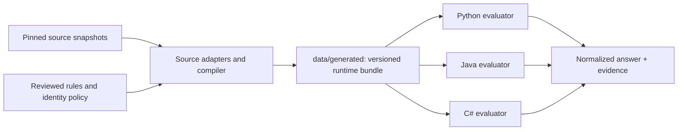

# Architecture

orVIN builds a language-neutral vehicle database from pinned public sources and
reviewed factual rules. Acquisition is explicit; compilation and lookup work offline.

- `tools/nhtsa.py`, `kba.py`, `astra.py` and `decoding.py` understand provider formats,
  upstream tables and filtering. They retain record IDs, source editions and hashes.
- `data/europe/` contains the two historical reviewed OEM inputs. The compiler
  translates these into ordinary conditional-literal rules. New supported rules can
  use `data/rules/*.json`, validated by `data/rules.schema.json`.
- `data/policy/identity.json` owns display names and reviewed aliases;
  `data/policy/decoder.json` owns field mappings, year schemes, cardinality, scope,
  stages and status/assumption metadata. New operations require engine changes;
  supported factual additions require data and compilation only.
- `tools/identity.py` compiles aliases. `tools/compile_dataset.py` creates the common
  manifest, tables and indexed shards in `data/generated/`. It never downloads data.
- `libs/python/`, `libs/java/` and `libs/dotnet/` implement the same bounded matching,
  grouping, consensus and conflict mechanics. They read identical runtime bytes.
  Public legacy Python/Java raw DTOs are compatibility projections of those bytes.
- Exact type-code lookups, identifying VIN claims, WMI assignments and catalogue
  candidates retain distinct evidence roles. Applicable facts take precedence;
  foreign-market identity matches remain labeled suggestions. Conflicts and partially
  mapped catalogue labels never become majority-vote guesses.
- The Flask API is a separate repository. It validates transport input and displays
  library results; it does not implement its own vehicle decisions.

Published JAR, wheel/sdist and NuGet packages contain generated data, provenance and
notices. Original permitted archives stay in Git for reconstruction; they are not
needed at runtime. No decoder makes network calls or executes archived SQL.

See the [runtime format](compiled-runtime.md), [output contract](normalized-output.md),
[source rights](research/data-redistribution/README.md), and
[migration plan](plans/compiled-dataset/plan.md).
