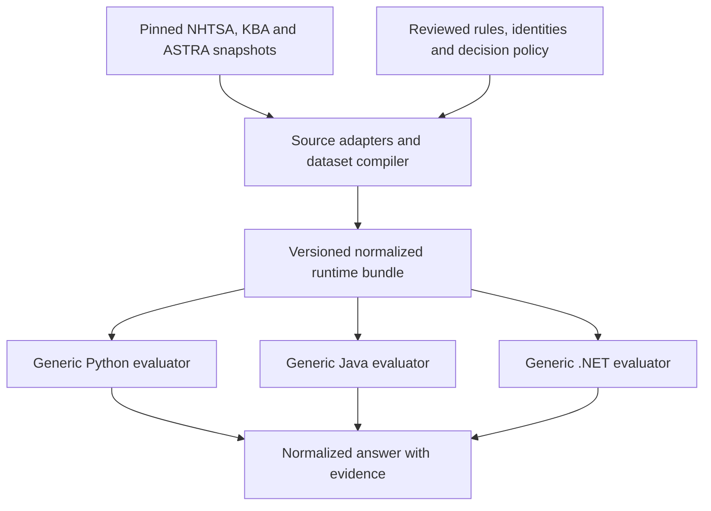

# Compiled dataset and generic runtimes

Status: implemented and locally verified on `codex/compiled-runtime`, authorized on
2026-09-26. Not yet released. Initial audit based on `main` at `b2b8ac8`.

## Objective

Make ORvin's vehicle knowledge live in reviewed data and build tooling. Python, Java and
.NET execute the same generated dataset through small, generic evaluators.
Adding a make, model, alias or rule expressible by the supported operations should
require no library source changes. New operations still require an explicit format
and engine change in all three languages.

Keep offline packages, public entry points, source attribution, and the short/long
answer relationship. The user subsequently approved keeping permitted originals in
the repository while shipping only compiled runtime data, provenance and notices.
This work does not itself add manufacturer coverage.

## Accepted follow-up decisions

- Retain the reviewed structured snapshots in Git. The redistribution assessment
  is recorded in [the source-terms review](../../research/data-redistribution/README.md).
  Downloading at build time would not by itself change downstream reuse obligations.
- Ship the generated runtime bundle in JAR/wheel/sdist/NuGet; omit raw archives and
  validation fixtures. Keep original source hashes, locations and required notices
  available in short and long outputs and all three packages.
- Market remains optional in the libraries because current registration country does not establish
  original sales-market specification. Unknown remains explicit. Do not infer it
  from WMI geography or the caller's location.
- Add a labeled cross-market suggestion when the requested market has no usable
  answer. It must stay SUGGESTED, retain its source market and requested market,
  and never replace a supported answer, hide conflicts, mix incompatible identities
  or promote unverified technical specifications. Do not claim a statistical
  probability; use “possible match from US data; applicability to AT unverified”.
- Keep the existing local baseline outside the repo at
  `/tmp/orvin-before-migration.json.gz`; it is a comparison aid, not new truth fixtures.

## Initial audit (before migration)

| Area | Current implementation | Gap |
| --- | --- | --- |
| Acquisition | `tools/nhtsa.py`, `tools/kba.py`, `tools/astra.py`, `tools/refresh_data.py` fetch or import pinned inputs. | Keep source-specific acquisition in tooling. |
| Compilation | `tools/decoding.py` resolves dictionaries and generates pattern shards; `tools/astra.py` compiles masks; `tools/identity.py` builds aliases. | Generated formats still reflect separate providers and OEM layouts. |
| Runtime decoding | Python `details.py` and Java `RichDecoder.java` interpret compiled patterns. | Both also implement Tesla/Golf paths, US year-cycle rules, source ranking, joins and conversion policy. |
| Identity resolution | Python `answer.py` and Java `AnswerBuilder.java` choose normalized fields and construct explanations. | Source arbitration, fallback rules and status policy are independently coded twice. |
| Packaging | Both artifacts embed all of `data/`; parity and byte-for-byte packaging checks exist. | WMI loading also uses a Java-only TSV projection; there is no single runtime contract for all inputs. |

Concrete examples:

- [`details.py`](../../../libs/python/orvin/details.py) contains `_europe`, `_oem`,
  `_years` and `_pass`; [`RichDecoder.java`](../../../libs/java/src/main/java/com/openresearch/orvin/RichDecoder.java)
  repeats these operations. Tesla sequence validation and Golf-specific stage and
  warning strings are runtime code, even though their factual mappings are data.
- Those decoders return the first matching OEM path before evaluating other paths.
  This is a policy choice hidden in control flow and can conceal overlapping claims
  when coverage grows. Changing it needs a reviewed behavior change, not an unnoticed
  side effect of moving files.
- [`answer.py`](../../../libs/python/orvin/answer.py) and
  [`AnswerBuilder.java`](../../../libs/java/src/main/java/com/openresearch/orvin/AnswerBuilder.java)
  separately implement WMI fallback, US assumptions, Swiss catalogue consensus,
  context conflicts and make/model/year consistency.
- [`tools/identity.py`](../../../tools/identity.py) already moves normalization to
  build time, but reviewed display preferences and explicit aliases are Python
  constants rather than separately reviewable policy and mapping records.

The pre-migration design was partly compiled but still duplicated vehicle knowledge
and policy. The completed work below replaces those runtime paths.

## Target flow

Fetching is explicit and separate from compilation. Compilation and ordinary builds
work offline from pinned inputs. The runtime reads only the compiled bundle for
decisions; retained originals remain in the repository for inspection and traceability.

One normalized dataset means one logical contract, not one enormous JSON file or
one table that conflates VIN facts, WMI assignments, HSN/TSN types and approvals.

## Dataset contract

Use JSON plus schemas for human-authored rules and policy. Compile to deterministic,
indexed UTF-8 tables and compressed shards, retaining the existing dependency-free
runtime approach. Both languages read identical compiled bytes, including WMI data.
Introduce `data/generated/` incrementally; do not relocate every existing source
snapshot as part of the first migration.

The bundle should contain:

- **Manifest:** format, dataset and decision-policy versions; required engine
  capabilities; compiler identity, input hashes and hashes for every runtime file.
  Unsupported formats or operations fail clearly during loading.
- **Identities and fields:** stable make/model IDs, reviewed display names, typed
  fields, units and explicit mapping outcomes. Canonicalize static values at build
  time. Preserve original labels and unmapped records; missing mappings must not
  disappear from consensus checks.
- **Matching rules:** VIN predicates, ordinary/extended WMI keys, exact HSN/TSN
  keys, scope constraints, year-code tables, capture positions and lookup tables.
  Include whether missing context makes a rule conditional and whether supplied
  context excludes it or creates a contradiction.
- **Claims and alternatives:** values or bounded extraction/derivation operations,
  evidence kind, configuration/group IDs and parent references. Keep catalogue
  candidates distinct from identifying evidence and keep their specifications
  correlated; a shared VIN mask does not make all engines true for one car.
- **Selection metadata:** source-internal order and cardinality, explicit reviewed
  supersession, evidence roles and the decision table for statuses, assumptions
  and fallback. Do not use one numeric source score or let import order pick a winner.
- **Provenance:** field-to-rule-to-source lineage, precise upstream locators,
  snapshot hashes, editions, reuse assessments, required credits and notices.
  Store explanatory reason codes/messages with the policy or rule they explain.

Separate upstream selection semantics (such as NHTSA's ordering of matching
patterns) from ORvin's cross-source resolution. Preserve the former while reviewing
changes to the latter explicitly. A US-scoped rule and an approval catalogue are
different evidence roles, not universally higher/lower ranked providers.

## What remains in a library

A library validates input, verifies/loads indexed data, evaluates applicable rules,
retains compatible alternatives, applies the shared decision policy and serializes
the answer. It also handles caching, immutable/fresh results and language bindings.

Use a small, specified set of operations: exact lookup, bounded position/pattern
matching, context constraints, table-driven year alternatives, literal/captured
values, relational lookup, decimal scaling, grouping, selection and consensus.
Define character normalization, match boundaries, nulls, ordering, decimal precision
and rounding once in the format specification. Source wildcard syntax must be
translated by the compiler into the common representation.

This is a constrained evaluator, not a general programming language. No embedded
Python, Java, SQL or arbitrary expressions. Generic evaluation code exists in each language;
vehicle facts, provider interpretation and reviewed policy are authored once.

It is neither practical nor correct to precompute one row per possible VIN. Matching
and decisions depend on the queried VIN, optional market/year context and competing
claims. The compiler can precompute aliases, joins, lookup values and static ordering;
the runtime must still evaluate query-dependent conditions and captures.

## Implementation sequence

1. **Specify the contract and establish the baseline.** Inventory existing runtime
   decisions; distinguish generic mechanics, source semantics and ORvin policy.
   Specify the minimal operations against actual existing inputs. Record behavior,
   package size, cold-start time and warm-query performance. Keep independent
   sourced fixtures as the correctness authority; old output is a regression aid.
2. **Compile an OEM vertical slice.** Add the manifest/schema and compiler entry
   point, move reviewed aliases/display preferences to declarative inputs, and
   express the existing Golf and Tesla rules in the common format. Implement the
   necessary generic evaluator in all three languages. Verify the same existing answers
   and provenance with no Golf/Tesla-specific runtime branches. Keep other paths
   on their existing implementation temporarily.
3. **Migrate exact lookups and approval candidates.** Compile WMI and KBA indices,
   then ASTRA masks, normalized labels and correlated approval records. Retain
   leading zeros, missing mappings, original remarks and every relevant candidate.
   Remove language-specific WMI projection as the new common reader takes over.
4. **Migrate NHTSA semantics.** Compile schema applicability, public patterns,
   multi-value fields, year schemes, engine/model relations, source-internal
   precedence and conversions into the same contract. Precompute what is static;
   preserve query-dependent conditions, source lineage and conditional US scope.
   Avoid expanding every rule across all VINs or years just to simplify the engine.
5. **Unify resolution and public projections.** Feed all applicable claims into the
   generic resolver using the versioned policy. Remove source-specific fallback
   branches and early-return dispatch. Review every newly exposed overlap or changed
   result; do not force old behavior where it concealed conflicts. Preserve API
   shapes and raw access through compatibility projections. Any intentional public
   behavior/provenance-ID changes need migration notes and appropriate versioning.
6. **Switch validation, packaging and refreshes.** Rebuild the complete compiled
   bundle from pinned inputs and reject stale output. Check all source/field
   references, installed artifacts and language parity. Update release manifests,
   provenance inventories and refresh output allowlists. Delete superseded runtime
   paths after migration checks pass, avoiding two permanent decoder systems.

Each step should be a reviewable change. Do not add the pending BMW/Subaru coverage
inside the architectural migration; that would obscure whether changed answers
come from new evidence or a different evaluator.

## Acceptance and release boundaries

- An additional rule using existing operations changes only reviewed input data,
  fixtures and generated output, with no Python/Java/.NET runtime edits. A controlled
  synthetic example demonstrates this rather than relying only on a code search.
- Runtime decisions do not branch on manufacturer names, provider names, source
  IDs or source-specific numeric field IDs. Original source identifiers remain
  available as evidence and in compatibility projections.
- Compare old/new results and cross-language results separately. Exercise positive,
  near-miss, missing-context, year-cycle, overlap, conflicting-context and partially
  mapped catalogue cases. Input/rule reordering and duplicate rows must not change
  selected identity merely by changing order or apparent vote counts.
- Review changed behavior against independently sourced expected facts; parity
  cannot prove that the shared compiler is correct. Never regenerate expected
  fixtures solely from the new implementation.
- Short/long JSON retain their exact relationship: long is short plus `details`.
  Both preserve required attribution; all evidence references resolve. Model year,
  production year and approval dates remain distinct.
- JAR and wheel embed identical generated runtime data and required notices,
  excluding retained raw snapshots and validation fixtures. Lookup performs no
  network access or raw-source parsing.
- Demonstrate deterministic rebuilds, bounded loading, and acceptable size/startup/
  query performance against the recorded baseline before replacing the old paths.
- Daily structured-data refreshes may update generated output only through the
  reviewed compiler and existing gates. New rules, policy, operations, sources or
  license assessments remain manual changes. Expanding the output allowlist must
  not authorize edits to curated inputs or expected fixtures.

## Completed implementation

All six slices are implemented. `tools/compile_dataset.py` emits the versioned
`data/generated/` contract, specified in [compiled runtime](../../compiled-runtime.md).
Reviewed identities/profile policy are declarative inputs; generic literal rules
replace OEM dispatch. All engines use the same WMI, KBA, ASTRA, pattern and identity
bytes. Source-specific import/adaptation remains in tooling. Generic selection and
consensus mechanics remain in each runtime; their shared invariants are documented.

.NET uses namespace `OpenResearch.ORvin`, targets .NET 8+, and packages embedded
resources as `OpenResearch.ORvin`. CI covers all three languages, installed NuGet
consumption on Windows, byte checks, parity and tagged release publication. No
NuGet release has been published yet.

Cross-market fallback works for any pair of two-letter country codes. Supported
claims and conflicts block foreign fallback. Foreign values remain suggestions,
with the requested/source markets, lineage and notices. This does not expand any
rule's reviewed scope. Synthetic JP/BR/NZ rules exercise the generic operation.

The separate `orvin-api` branch requires a country for VIN requests, defaults only
from an explicit browser-locale region, and shows flag plus two-letter code before
the query. HSN/TSN disables the country field. The release dependency remains pinned
until the existing daily updater adopts the next stable ORvin release.

## Local validation and rollout

- 43 Python behavioral tests, 50 Java tests and 44 tooling tests passed, along with
  the .NET behavioral checks. Existing independently sourced fixtures were retained.
- 4,866 Java/Python complete results and 3,244 .NET/Python normalized results agree,
  including detailed evidence, unknown fields and attribution.
- The 120-query baseline comparison has no regressions in previously resolved
  primary fields. Twenty primary answers change in AT/DE contexts due to the
  explicitly requested foreign-market suggestions. This is a regression comparison,
  not an independent truth set.
- Locally measured cold load was 0.149 s, followed by 120 normalized lookups in
  0.734 s. Timing is indicative and hardware/cache dependent; the old mixed raw and
  normalized timing is not a directly comparable benchmark.
- The JAR and wheel contain exactly 523 identical runtime files (about 34.7 MB and
  34.6 MB respectively), compared with the previous roughly 128 MB artifacts.
  Required source notices remain; raw snapshots and validation fixtures are excluded.
- Source reconstruction and generated manifest/inventory checks pass. Installed
  artifact and repeat-build checks are recorded in the source audit.
- API ruff checks, 15 tests including real Valkey, a container startup/contract smoke
  check and a local browser check passed. This records local work, not deployment.

Remaining rollout: review the migration, run hosted CI, publish a stable release,
then let the API's daily dependency update build and deploy that release. No source
refresh, new manufacturer rule, production deployment or release tag is part of
this architectural change itself.
